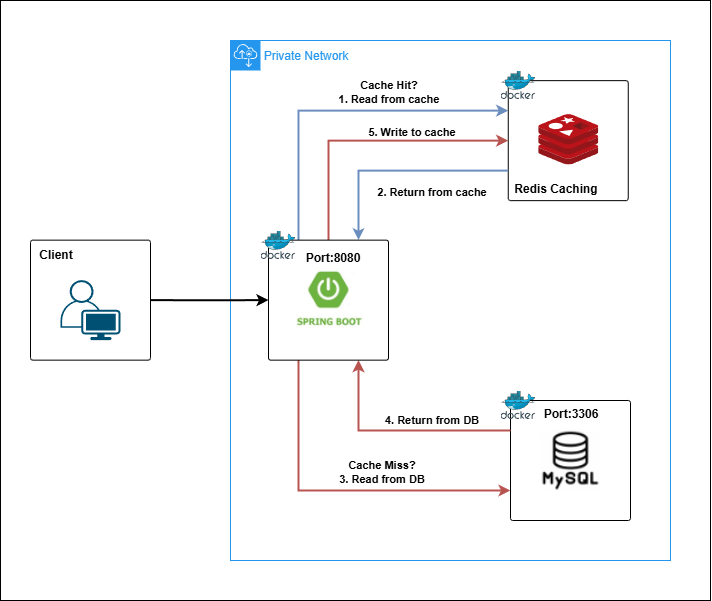

## Stack Mentor

Stack Mentor is a Spring Boot–based CRUD API that leverages Spring AI and OpenAI’s LLMs to generate personalized learning path recommendations for software engineers based on their technology stack. The project showcases modern backend practices, including:

- **Spring Data JPA:** Simplified database interactions with an ORM-based persistence layer.
- **AI integration:** Leveraging Spring AI to generate intelligent responses and recommendations.
- **Caching with Redis:** Boosting performance and minimizing database load through Redis-based caching.
- **Containerization with Docker:** Providing a portable and reproducible runtime environment.

---

## Redis Caching

<div align="center">
  
</div>

- **1, 2:** The application first checks Redis. If the requested data is available, it is retrieved directly from the cache, avoiding a database query.

- **3, 4, 5:** If the data is not found in Redis, the application queries the database. Once the data is retrieved, it is stored in the cache for faster access in future requests.

---

## How to Run the Project

1. Make sure you have **Docker** installed on your system.
 ```bash
  docker --version
 ```
2. Create the environment variables according to **env.example** file.
3. Make sure the project profile is set to the **production profile**.
4. Open a terminal in the project directory and run the following command to build and start the application:

```bash
  docker-compose up --build -d
 ```
